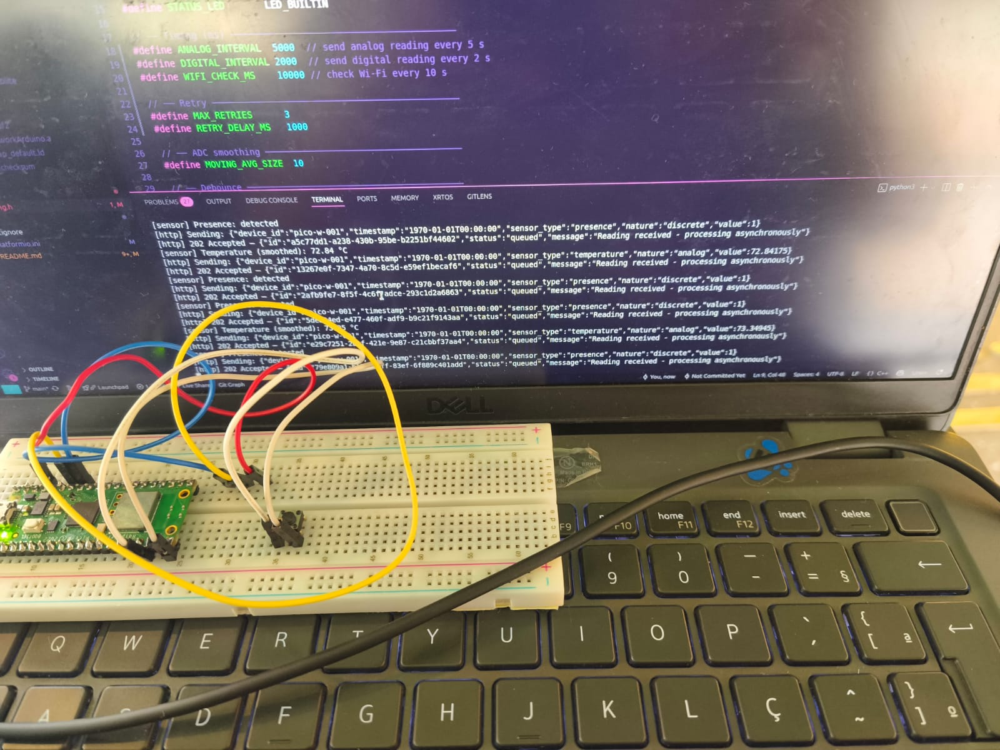
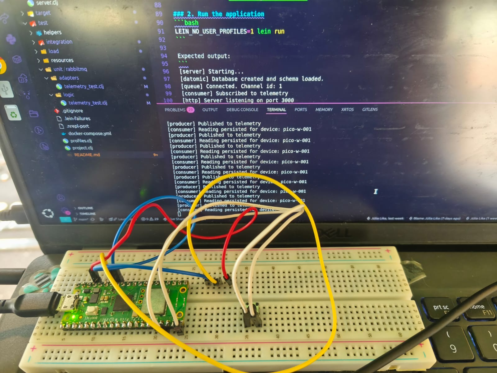
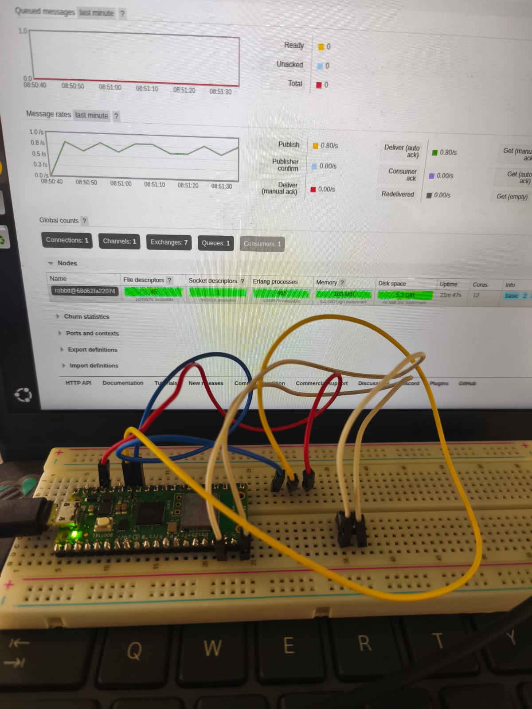

# Pico Telemetry Firmware

Firmware embarcado para **Raspberry Pi Pico (RP2040)** que lê sensores analógicos e digitais e imprime os dados via serial USB.

## Framework / Toolchain

**Arduino Framework** via [PlatformIO](https://platformio.org/) com o core [arduino-pico (earlephilhower)](https://github.com/earlephilhower/arduino-pico).

---

## Hardware necessário

- Raspberry Pi Pico (RP2040)
- Potenciômetro (10kΩ recomendado)
- Botão (push button)
- Cabo USB (dados, não apenas carga)
- Protoboard e jumpers

---

### Pinagem do potenciômetro

| Pino do pot | Pino físico do Pico | Função |
|---|---|---|
| Terminal esquerdo (VCC) | Pino 37 — 3V3 OUT | Alimentação 3.3V |
| Terminal do meio (wiper) | Pino 34 — GP28 / ADC2 | Sinal analógico |
| Terminal direito (GND) | Pino 33 — AGND | Terra analógico |

> **Atenção:** O ADC do Pico suporta no máximo **3.3V**. Nunca conecte 5V ao pino de sinal.

### Pinagem do botão

| Pino do botão | Pino físico do Pico |
|---|---|
| Terminal 1 | Pino 20 — GP15 |
| Terminal 2 | Qualquer GND |

O pino usa `INPUT_PULLUP` — lê `LOW` quando pressionado.

---

## Sensores configurados

| Sensor | Pino GPIO | Pino físico | Intervalo |
|---|---|---|---|
| Potenciômetro (analógico) | GP28 / ADC2 | 34 | 5 s |
| Botão (digital) | GP15 | 20 | 2 s |

---

## Pré-requisitos de software

- Python 3.x instalado
- PlatformIO CLI:
  ```bash
  pip install platformio --break-system-packages
  ```

---

## Compilar o firmware

```bash
cd pico-w-telemetry
platformio run
```

O firmware compilado fica em `.pio/build/rpipico/firmware.uf2`.

---

## Gravar no Pico

1. **Segure o botão BOOTSEL** no Pico
2. **Conecte o cabo USB** ao computador enquanto segura
3. Solte o BOOTSEL — o Pico monta como drive `RPI-RP2`
4. Copie o firmware:
   ```bash
   cp .pio/build/rpipicow/firmware.uf2 /media/$USER/RPI-RP2/
   ```
5. O Pico reinicia automaticamente e começa a executar

> Se aparecer erro de permissão na porta serial, adicione seu usuário ao grupo dialout:
> ```bash
> sudo usermod -a -G dialout $USER
> ```
> Depois faça logout e login novamente.

---

## Monitorar saída serial

```bash
platformio device monitor -d ~/projetos/pico-w-telemetry
```

Saída esperada:

```
======= Pico Telemetry (Serial) =======
[sensor] analog  | raw_value: 110.45
[sensor] digital | presence: none
[sensor] analog  | raw_value: 215.30
[sensor] digital | presence: detected
```

- Gire o potenciômetro → `raw_value` muda entre 0 e 330
- Pressione o botão → alterna entre `detected` e `none`

---

## Fotos
<div align="center">
  
  <p>Sensores sendo lidos no pico-w-telemetry</p>
</div>
<div align="center">
  
  <p>Backend recebendo leitura dos sensores</p>
</div>
<div align="center">
  
  <p>RabbitMQ mostrando as requisições</p>
</div>
